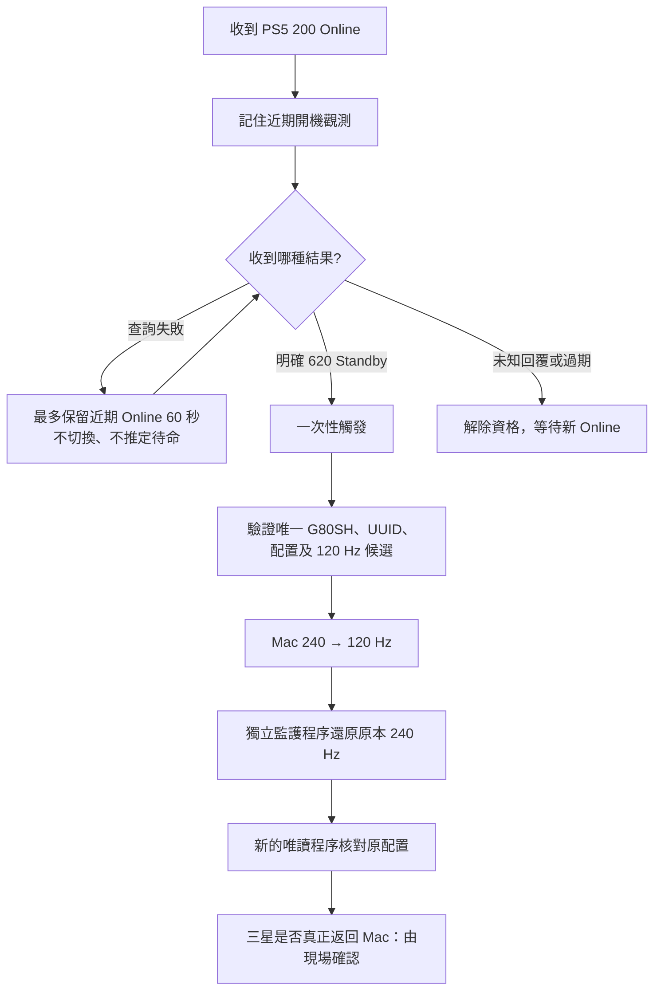

# PS5 → Samsung → Mac Auto Return

PS5 進入待命後，讓三星螢幕自動從 **HDMI 2 返回 Mac 的 USB-C 畫面**。

這是 Personal Control Center 的實驗性 macOS 原始碼分享版：透過區域網路確認 PS5 待命，再讓 Mac 執行 **240 → 120 → 240 Hz**，重新產生顯示模式切換，讓三星的 Auto Source Switch+ 有機會選回 Mac。不切換 HDR、不重置 USB、不透過 SmartThings，也不需要其他控制螢幕 App。

**不是喚醒 PS5、不是喚醒睡眠中的 Mac，也不是通用 HDMI 切換器。** Mac 必須保持清醒、持續連接 USB-C。可能有短暫黑畫面；是否能返回取決於現場顯示器與訊號狀態，不保證無縫或所有三星機型相容。

## 產品相容性與接線範例

| 類別 | 公開相容性說明 |
| --- | --- |
| 三星螢幕 | Odyssey OLED G8 **G80SH**；此型號是程式的相容性目標，需使用者自行確認 4K／240 Hz 與 Auto Source Switch+ 設定 |
| Mac | 需要可編譯本專案的 macOS SDK；測試時請保留內建螢幕可操作 |
| 遊戲主機 | PS5；韌體與網路介面由使用者自行確認 |
| 影像接線 | PS5 → 三星 **HDMI 2**；Mac → 三星 **USB-C（Type-C）** |
| 網路 | Mac 與 PS5 位於可互通的區域網路；PS5 位址只在本機設定，不應提交 |

三星的[官方 G80SH 32 吋規格頁](https://www.samsung.com/uk/monitors/gaming/odyssey-oled-g8-g80sh-32-inch-4k-uhd-240hz-ls32hg802suxxu/)列有 4K、240 Hz、USB-C、Auto Source Switch+。這是產品相容性參考，不代表任何特定使用者的實機測試；**不要將此說明套用到 G80SD／其他 G8／Tizen Smart Monitor。**

```text
Mac（保持清醒） ── USB-C ──┐
                          ├── Samsung G80SH（Auto Source Switch+ 開啟）
PS5 ───────────── HDMI 2 ──┘
 │
 └── Wi-Fi／區域網路 ── Mac 上的 PS5 狀態偵測（UDP 9302）
```

## 為什麼需要這個方案？

PS5 開機後的新 HDMI 訊號可能讓螢幕自動選到 PS5。但 PS5 待命後，Mac 的 USB-C 可能早已持續輸出，沒有新的變化，螢幕不一定會自動返回。

顯示模式變化可能觸發重新選源，但不證明任意訊號都能做到。為了不改 HDR 偏好，流程選用同尺寸的更新率往返；DDC 輸入值寫入與同模式重套不列為有效備援。

## 完整流程



- UDP 9302 的狀態列 `200` 為開機，`620` 為待命；這是本機使用的非官方偵測方式，不是 Sony 支援的控制 API。
- 開機時每次 probe 完成後等待 0.5 秒，其他狀態等待 2 秒；單次 probe 可等到 2 秒。**不是保證 0.5 秒內發現待命。**
- 60 秒從最近一次明確 Online 計算，不因 timeout 延長；只有期限內的明確 Standby 回覆才切換。重複待命不重複執行。初次啟動已待命不切換。
- 改 PS5 IP、Mac 睡眠／喚醒、停用、收到未知狀態會中斷舊序列。
- helper 嚴格要求可用內建螢幕、唯一外接 G80SH（vendor 19501／model 31508）、不鏡像，以及相同尺寸／相容 flags 的唯一 120 Hz 候選。其他配置會拒絕，不自動改用 60 Hz。
- 更新率往返不是直接「選 USB-C」命令；畫面返回依賴螢幕實際選源行為。CG active、DDC 讀值或 API success 都不能單獨證明已選回 Mac。

## 取得與建置

需要能編譯本專案 SwiftUI API 的 macOS SDK（26 或以上）、Swift 6 工具鏈／Xcode 或 Command Line Tools。deployment target 是 macOS 13；請在自己的工具鏈與硬體上重新執行驗證。

```bash
   git clone https://github.com/<YOUR_GITHUB_ACCOUNT>/ps5-samsung-mac-auto-return.git
cd ps5-samsung-mac-auto-return
bash script/build_and_run.sh --build-only
```

建置入口會把獨立 helper 放進 App bundle。`--build-only` 不啟動、不停止正在執行的 App；完成後從輸出的 `.app` 路徑自行開啟。也可使用 `bash script/build_and_run.sh --verify` 建置及啟動。一般 run 模式會停止同名稱的舊 App。

**本次提供原始碼，不提供已簽署／公證的正式安裝版。** 本機建置產物不是 Developer ID 簽署或公證發行版。不要為了測試關閉 Gatekeeper／系統安全機制。直接使用 Xcode scheme、未經建置入口包入 helper 時，自動返回可能不可用。

## 第一次設定：先唯讀，再現場測試

1. 開啟三星 Auto Source Switch+；確認 PS5 在 HDMI 2，Mac 在 USB-C。保留 Mac 內建螢幕，Mac 設成可用的固定 240 Hz、不鏡像，僅連接這一台外接螢幕。
2. 在 Mac 內建螢幕執行以下唯讀 preflight：

   ```bash
   bash script/probe_refresh_pulse.sh
   ```

    成功會輸出當次的目標識別碼與模式摘要。這些值只供本機下一步使用，不要貼到公開 issue；此模式不會送出顯示模式交易，若停止請先修正配置，不略過保護。

3. App「設定」填入 **自己的 PS5 IP** 與上述 **自己的 targetUUID**。預設皆空白，自動返回預設關閉。不要使用他人的 IP／UUID／mode ID。
4. 先閱讀 [安全與驗收](docs/SAFETY.md)。將三星切到 HDMI 2，確認 Mac 當下 HDR 基準是 on 或 off，再從內建螢幕做一次明確授權的手動測試：

   ```bash
   # 下列都是當次 preflight 的值；HDR 基準由操作者現場觀察。
   bash script/probe_refresh_pulse.sh --apply-once \
     --target-uuid '<YOUR_TARGET_UUID>' \
     --expected-mode '<YOUR_CURRENT_EXPECTED_MODE>' \
     --hdr-baseline off \
     --confirm-hdmi2
   ```

   **會真的變更更新率，可能黑畫面兩次。** 若當下 HDR 是開啟，使用 `--hdr-baseline on`，不要為了範例去關 HDR。參數只記錄現場基準，工具不操作 HDR，也不驗證低階色彩屬性。
5. 確認三星真的返回 Mac、原更新率還原、沒有不希望的畫質變化後，再開啟 App「PS5 待命後返回 Mac」。請用 PS5 開機 → 待命做一次完整測試。收到近期 Online 是觸發必要條件；單純切到 HDMI 2 或啟動 App 已在待命，不會補切。
6. 若失敗，停用並查看 App 診斷。不要連續手動重送、掃描未知 DDC 值或改動保護門檻。

更改公開版目標 UUID 會停用自動返回，必須重新現場確認再啟用。這個可設定目標是分享版的必要差異；原成功配置的模式切換、監護及偵測核心保持原樣。分享版建置／非硬體測試與原本的實機結果應分開看待。

## 驗證邊界

公開來源只提供可重現的單元測試、狀態機測試與唯讀 preflight；顯示器是否實際返回，必須由使用者在自己的接線與設定下現場確認。公開版本不宣稱任何特定電腦、系統組建、螢幕韌體或成功率，也不附測試紀錄、診斷輸出或效能時間。

請勿把本專案的產品相容性參考當成普遍相容保證。

## 測試與程式位置

```bash
bash script/test_return_to_mac.sh
bash script/test_refresh_pulse.sh
```

分別涵蓋 16 項狀態／短暫斷訊／解析器／取消等回歸，以及 14 項計畫／漂移拒絕／還原一試檢查＋5 項 CLI 錯誤拒絕。測試不會切換硬體。

- `PersonalControlCenter/Modules/PS5/`：UDP 偵測及查詢節奏。
- `PersonalControlCenter/Services/ReturnToMacRule.swift`：明確開機 → 待命與 60 秒保留。
- `PersonalControlCenter/Services/AutomationCoordinator.swift`：生命週期、開關、一次性觸發。
- `PersonalControlCenter/Services/RefreshReturnService.swift`：背景啟動內建 helper。
- `script/RefreshPulse/`、`script/ModeReapply/Core.swift`：配置驗證、交易、獨立監護與唯讀末次確認。

App 其他裝置模組仍是未整合佔位；此專案不代表已支援那些裝置。DDC 留作進階診斷，不是此方案的有效返回路徑。

## 隱私、授權與聲明

PS5 IP／目標 UUID 只存本機偏好，不提交到 GitHub。公開內容不附原操作者的 IP、MAC、SSID、UUID、序號或完整診斷紀錄。回報 issue 前先移除這些值，參見 [安全與驗收](docs/SAFETY.md)。

本次分享未選定開源授權條款，未附 LICENSE。非 Sony／Samsung／Apple 官方專案；產品名稱僅用於說明相容性。
